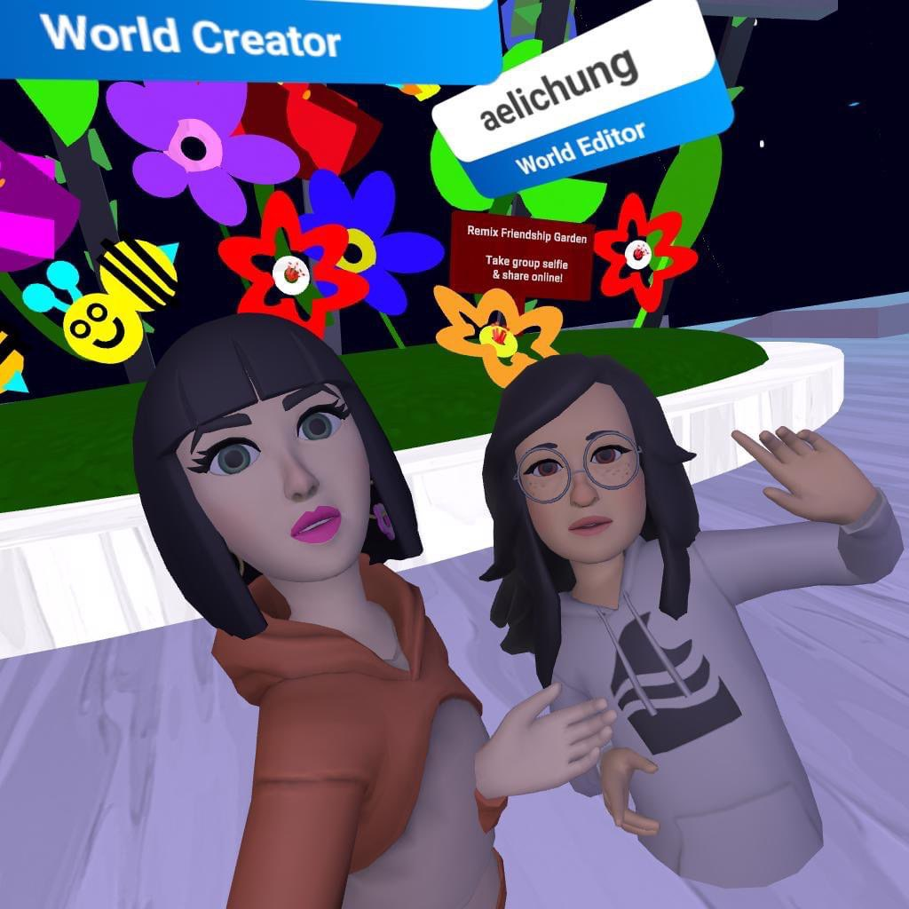

# RealityHack2022_FutureMIT_MediaLab
Future Metaverse explores how people may gather to solve problems together today and the future in Social VR. 

Garden Hacks, Script Examples, and Interactive Shapes offer visitors and groups opportunities to Hack together. Future Hackathons may happen across multiple platforms and worlds in the Metaverse.

Built in Horizon Worlds. You can explore this world using this [link](https://www.oculus.com/vr/5107373709328441/)

Disclaimer: Horizon Views requires a Quest 2 or Rift S headet! 

## Want to Participate?

1. Join the World-Building Collaboration (no experience necessary). 

2. Create something that goes in a garden using Horizon Worlds to import or in project world.

3. Share an idea, quote, poem, audio, or fashion idea you'd like to have included and we can make it happen!
